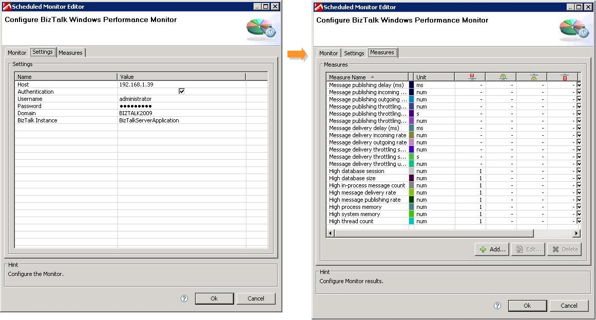

# Overview

Monitors BizTalk Host Instance specific Windows Performance Counters for a specific BizTalk Host Instance. Extends the dynaTrace Windows Performance Counter Monitor.

| Name | BizTalk Monitor Plugin
| :--- | :---
| Plug-In Version | 1.0.1
| Compatible with | dynaTrace 3.x, 5.6 (verified)
| Author | [MCG Systems](http://www.mcg-software.dk/) (Rasmus Toelhoej - rtoelhoej@mcg-systems.dk)
| License | [dynaTrace BSD](dynaTraceBSD.txt)
| Support | [Not Supported ](https://community.compuwareapm.com/community/display/DL/Support+Levels#SupportLevels-Community)
| Downloads |[BizTalk Monitor Plugin 1.0.1 provided by MCG Systems](com.dynatrace.diagnostics.plugin.BizTalkPerfMon_1.0.1.jar)

# Key benefits

Makes it easier to subscribe to all relevant BizTalk Windows Performance Counters

# Key features

Captures a list of windows performance counters specific to a BizTalk Host Instance

# Technical overview

The monitor is configured for a specific BizTalk Host Instance Name. The monitor then queries the following performance counters from the BizTalk:MessageAgent object for the specified instance:

  * High database session 

  * High database size 

  * High in-process message count 

  * High message delivery rate 

  * High message publishing rate 

  * High process memory 

  * High system memory 

  * High thread count 

  * Message delivery incoming rate 

  * Message delivery outgoing rate 

  * Message delivery delay (ms) 

  * Message delivery throttling state 

  * Message delivery throttling state duration 

  * Message delivery throttling user override 

  * Message publishing incoming rate 

  * Message publishing outgoing rate 

  * Message publishing delay (ms) 

  * Message publishing throttling state 

  * Message publishing throttling state duration 

  * Message publishing throttling user override 

  * FILE, SQL, SOAP and HTTP Adapter counters for sent/received messages 

# Install Description

  * Import the plugin on your dynaTrace Server 

  * Create a Monitor in your System Profile and configure all required monitor properties 

  * Add the measures to your Dashboard and monitor these values while running BizTalk 

# Screenshots

Showing a dashboard with some of the monitor's measures and the configuration dialogs:

BizTalk Monitor Configuration

Dashboard showing BizTalk Monitor Values

# Known Problems

